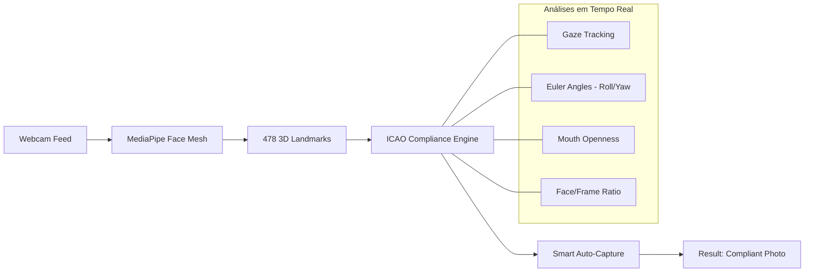

# 🛡️ Face app ICAO Edition

[](https://reactjs.org/)
[](https://google.github.io/mediapipe/solutions/face_mesh)
[](https://webassembly.org/)
[](https://en.wikipedia.org/wiki/Privacy_by_design)

**ICAO Face app** é um app de biometria e conformidade de alta performance para navegadores. Originalmente focado em detecção leve, esta versão foi refatorada para utilizar o **MediaPipe Face Mesh**, permitindo análise sub-milimétrica de conformidade com os padrões internacionais **ICAO 9303** (Passaportes e IDs).

---

## 🚀 Por que MediaPipe Face Mesh?

Diferente de modelos convencionais de 68 pontos, o Face Sentinel agora utiliza uma malha de **478 pontos em 3D**, oferecendo:

*   **🔍 Ultra-Precisão**: Mapeamento detalhado de lábios, pálpebras e íris.
*   **👁️ Rastreamento de Íris**: Validação em tempo real se o usuário está olhando para a câmera (Gaze Detection).
*   **⚡ Aceleração via WASM/GPU**: Processamento em tempo real (30+ FPS) utilizando WebAssembly, sem sobrecarregar a CPU.
*   **📏 ICAO-Ready**: Algoritmos geométricos avançados para validar inclinação (Roll), rotação (Yaw), expressão neutra e enquadramento.

---

## 🛠️ Arquitetura Técnica

O Face Sentinel processa o feed de vídeo diretamente na GPU do cliente, extraindo coordenadas espaciais para alimentar um motor de regras de conformidade:



### 1. Motor de Conformidade ICAO
O sistema valida automaticamente os critérios necessários para fotos oficiais:
*   **Alinhamento da Cabeça**: Monitoramento de inclinação lateral e rotação.
*   **Enquadramento Inteligente**: Garante que o rosto ocupe entre 60% e 75% da altura da imagem.
*   **Detecção de Olhar**: Utiliza os pontos das íris para confirmar atenção direta à lente.
*   **Expressão Neutra**: Análise da distância entre marcos labiais para detectar sorrisos ou boca aberta.

### 2. Smart Auto-Capture (Intelligent Lock)
Implementa um sistema de "trava" síncrona que:
*   Analisa 30 frames por segundo.
*   Dispara o obturador instantaneamente ao detectar 100% de conformidade.
*   Evita capturas múltiplas redundantes através de um mecanismo de bloqueio atômico via `useRef`.

---

## 🚦 Performance Benchmarks

| Métrica | Resultado | Notas |
| :--- | :--- | :--- |
| **Pontos de Rastreio** | **478 Landmarks** | Incluindo refinamento de íris |
| **Latência de Inferência** | **10-25ms** | Em hardware padrão via WASM |
| **Conformidade** | **ICAO 9303** | Roll < 5°, Yaw Ratio < 1.6 |
| **Segurança** | **Liveness Passivo** | Análise de micro-movimentos e oclusão |

---

## 🏁 Início Rápido

### 1. Instalação
```bash
# Clone o repositório
git clone https://github.com/seu-usuario/face-sentinel.git
cd face-sentinel

# Instale as dependências (MediaPipe inclusas)
npm install @mediapipe/face_mesh @mediapipe/camera_utils @mediapipe/drawing_utils
```

### 2. Funcionalidades de Desenvolvedor
*   **Toggle Landmarks**: Checkbox para visualizar a malha geométrica em tempo real.
*   **Modo Dark/Light**: Interface adaptável para diferentes condições de iluminação.
*   **Download Instantâneo**: Exportação direta da foto capturada em alta resolução (1024px+).

---

## ⚙️ Configurações de Conformidade

As tolerâncias podem ser ajustadas em `src/App.js`:

| Parâmetro | Valor ICAO | Descrição |
| :--- | :--- | :--- |
| `ROLL_LIMIT` | `5.0°` | Inclinação lateral máxima da cabeça |
| `YAW_RATIO` | `< 1.5` | Proporção simétrica entre as bochechas |
| `MOUTH_THRESHOLD`| `0.025` | Limite para considerar boca fechada |
| `FACE_RATIO_MIN` | `0.55` | Altura mínima do rosto no frame |

---

## 🛡️ Segurança & Privacidade
*   **Sem Processamento em Nuvem**: Todo o reconhecimento e análise de conformidade ocorre no navegador do usuário.
*   **Vetores Voláteis**: Os pontos da face são processados em memória e nunca armazenados em bancos de dados.
*   **HTTPS**: Requisito obrigatório para acesso à API de câmera e MediaPipe.

---

**Desenvolvido para máxima precisão biométrica e conformidade documental. 🚀**